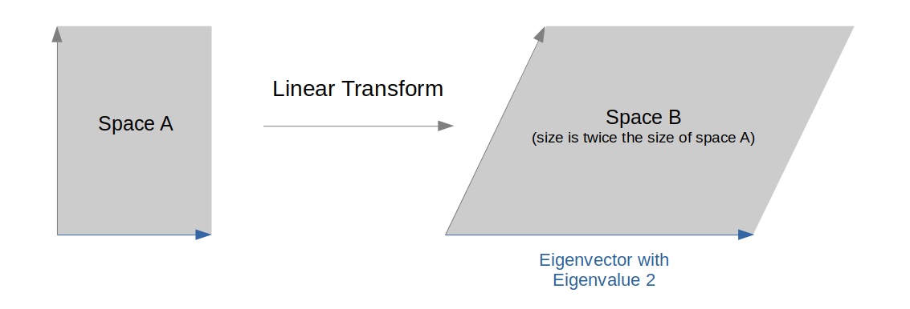

# SVD Challenge

SVD Challenge is a pedagogical example which allows you to test limits and computation timings of the used processor. 
It belongs to the domain of quantum-ai and addresses anyone with interest in the math behind D-Wave coding.

Singular values of a matrix are a generalization of the notion of Eigenvalues.
With Eigenvalues we can quantify the expansion or compression of a linear transformation of a vector space.
The linear transformation of a vector space is represented by a
normal square matrix. 
So Eigenvalues can only be computed for normal square matrices.



Singular values on the other hand can be computed for any matrix, in other words for any linear map from a vector space 
with dimension *m* to another vector space with dimension *n*).
Singular Value Decomposition (SVD) is a useful tool for

* data reduction 
* dimensionality reduction

and can be efficiently  used as a foundation for machine learning.

SVD example : Compute the SVD of the mxn = 3x2 matrix  A  : **A = U S V^T**

We use row-wise notation for matrices in the following.

A = ( ( 1 1 ), ( 1 1 ), (0 0 ) )

We denote the transposed matrix(A) by A^T  = ( (1 1 0), (1 1 0) )    
                                                                                     
 and the unity matrix by E.

1. Compute the min(m,n) = 2 = p .
   Compute the eigenvalues la_i of the matrix A^T A . ( If  m < n , compute the la_i of A A^T )
   
   A^T A  =  ( (2 2), (2 2) )   
             
       , that is solve the characteristic eq.  det( la E  - A^T A ) = 0
             
       Its eigenvalues are la_1 = 4 , la_2 = 0   
       
  The  **singular values(A) are the square roots(la_i)  s_1 = 2 , s_2 = 0** .
       

2. Compute the eigenvectors of A^T A, which form a **eigenvector basis of R^2** .
   These are the **right singular vectors**, that is the columns of the matrix V .
   
   
   
   

We want to test the limits and timings of SVD on binary and D-Wave processors,
in particular for so-called sparse matrices (matrices with many zero entries).


## Challenges

* The size of a matrix (RAM limit)
* The density of a sparse matrix (algorithmic challenge)

Density refers to the percentage of non-zero entries in a matrix with many zeros.


_____________________________________________________________________________________

## Usage

You can run the SVD challenge by executing the following command in the terminal:

```bash
cd [path to your cloned svd_challenge repository]
python svd_challenge.py
```

TBD: user input

## Code Overview

A general overview of how the code works.

We prefer descriptions in bite-sized bullet points:

* Here's an example bullet point

## Code Specifics

Notable parts of the code implementation.

This is the place to:

* Highlight a part of the code implementation
* Talk about unusual or potentially difficult parts of the code
* Explain a code decision
* Explain how parameters were tuned

Note: there is no need to repeat everything that is already well-documented in
the code.

## References

Dr. Peter Nonnemann and X.Bogomolec, "Condition Number of the Quantum Algebraic Attack on chosen Cryptosystems", [Condition Number of the QAA](https://github.com/Quant-X-Security-Coding-GmbH/QAA_Condition_Number).

The condition number designates the security level of the cryptosystem against the QAA. 
It is the ratio of the largest and the smallest singular value of the cryptosystem specific Macualay matrix.

## License

Released under the Apache License 2.0. See [LICENSE](LICENSE) file.
